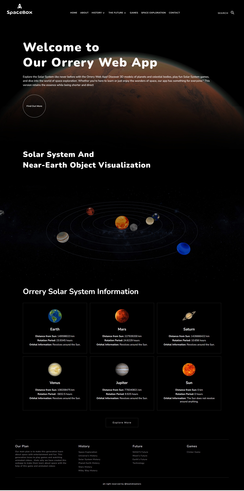
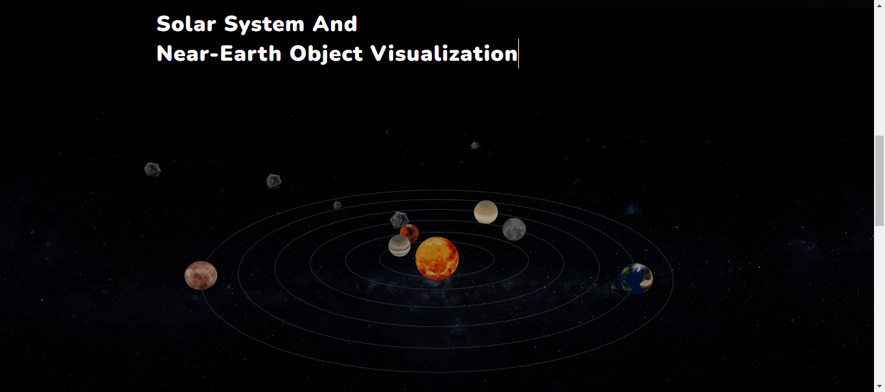
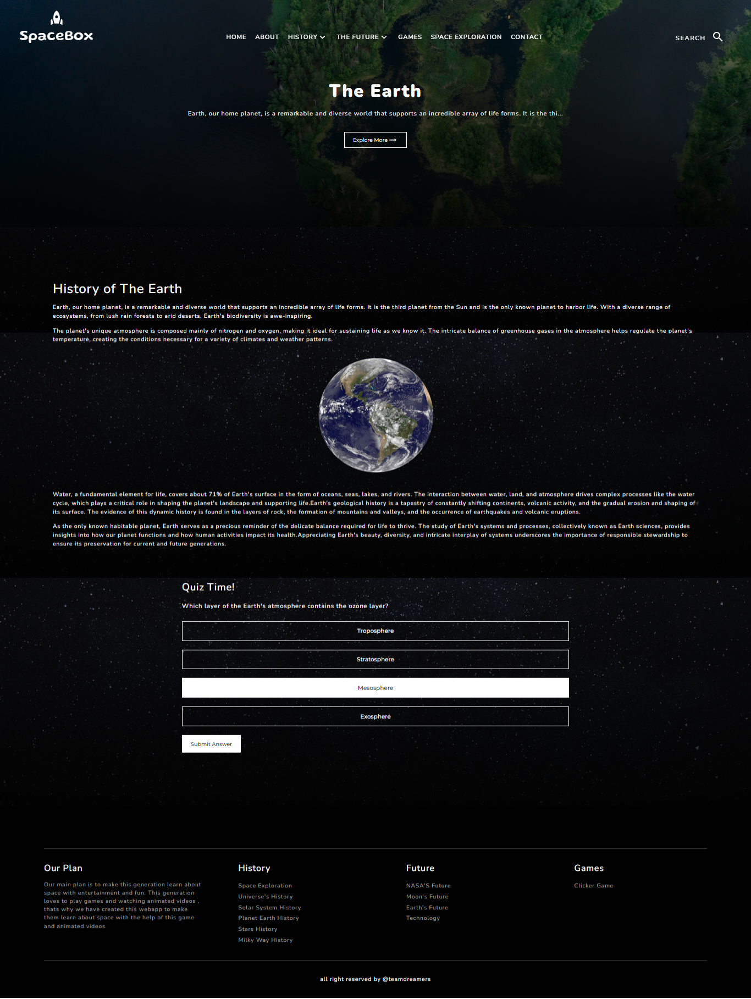
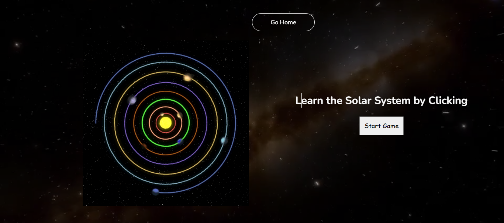
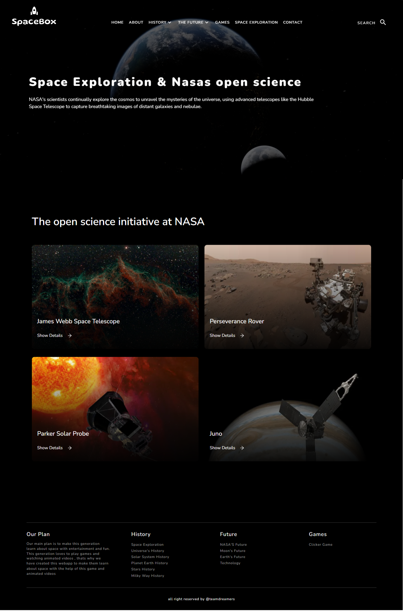
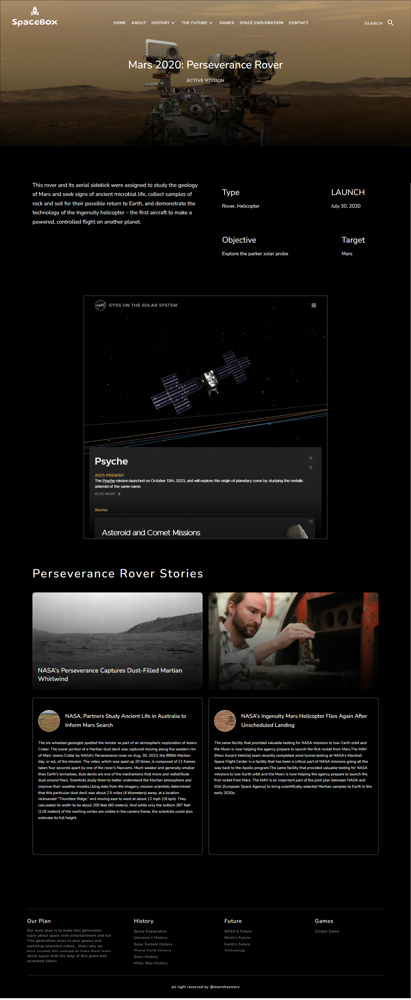

# Spacebox 🚀✨

Welcome to **Spacebox**—an interactive journey through the Solar System and beyond! 🌌

## Challenge: "Create an Orrery Web App that Displays Near-Earth Objects"

We took on the exciting challenge of developing an **Orrery Web App** that visualizes Near-Earth Objects (NEOs) in a stunning 3D diagram of our Solar System. Through this challenge, we didn't just stop at creating a visual representation. We went further by:

### 🌍 **Diagramming the Solar System in 3D**
Explore the vastness of our solar system like never before. Our dynamic 3D Solar System game makes learning about the planets engaging and fun for both kids and adults alike.

### 🎮 **Solar System Game**
For a deeper understanding and a more engaging experience, we've developed a **Solar System Game** that helps explain the intricate details of each planet. This interactive experience helps learners of all ages to immerse themselves in space exploration while having fun.

### 🧠 **Space-Themed Quiz Games**
To reinforce knowledge and challenge minds, we've created **quiz games** at the end of each lesson. These quizzes encourage users to test their knowledge of space and the Solar System while making learning interactive and enjoyable.

### 🌌 **NASA's Open Science & Space Exploration**
We proudly feature a variety of **NASA APIs** and other resources to visualize Near-Earth Objects, explore planets, and create engaging educational games. Below are the key APIs we've used:

#### Key Resources:

1. **Solar System and Near-Earth Object Visualization**  
   Use this API to fetch details about Near-Earth Objects within a date range.  
   `GET https://api.nasa.gov/neo/rest/v1/feed?start_date=2024-09-01&end_date=2024-09-07&api_key=YOUR_API_KEY`

2. **Planet Data and Exploration**  
   Explore data on various celestial bodies in the Solar System.  
   `GET https://api.le-systeme-solaire.net/rest/bodies/{planet_name}`  
   (Replace `{planet_name}` with the planet name, e.g., `earth`)

3. **Astronomy Picture of the Day (APOD) API**  
   Fetch daily images and space insights for creating a game.  
   `GET https://api.nasa.gov/planetary/apod?api_key=YOUR_API_KEY`

4. **Mars Rover Photos API**  
   Retrieve photos taken by NASA's Mars rovers (Curiosity, Opportunity, and Spirit) on specific Mars days (sol).  
   `GET https://api.nasa.gov/mars-photos/api/v1/rovers/{rover}/photos?sol={sol}&api_key=YOUR_API_KEY`  
   (Replace `{rover}` with the name of the rover, and `{sol}` with the Mars day number)

5. **Exoplanet Search API**  
   Access data about exoplanets for planetary exploration.  
   `GET https://api.leo.nasa.gov/planetary/exoplanet?api_key=YOUR_API_KEY`

6. **NASA Image Search API**  
   Search for images related to space and astronomy.  
   `GET https://images-api.nasa.gov/search?q={query}&media_type=image`  
   (Replace `{query}` with your search term)

---

We use these APIs to create dynamic visualizations of the Solar System, quiz games, and educational resources to inspire and teach users about space and planetary exploration.


### 📚 **NASA's History & Future Vision**
Discover NASA's inspiring history and its visionary goals for the future. Spacebox is not just a project—it's an educational tool that connects the past, present, and future of space exploration, offering insights into how these breakthroughs impact real lives.

---

We’ve gone beyond the original challenge to create an impactful learning platform that not only explains the Solar System but also makes the vastness of space more accessible to everyone.

---

### 🌟 **Why Spacebox?**

Spacebox is designed for everyone—whether you're a curious kid or an enthusiastic adult, whether you love games or deep space exploration. With lessons, quizzes, and interactive games, we aim to make learning about space fun and accessible for all.

---

Feel free to explore, learn, and challenge yourself with our quiz games! The universe is waiting for you—let Spacebox be your guide.


### 📸 Project Screenshots

Here's a sneak peek of our **Spacebox** project in action:

### Site View


### Solar System And Near-Earth Object Visualization


### Quizz for learning about solar system planets


### Learn solar sytem by gaming 


### Playing Game


### Space Exploration


### Space Exploration details page with 3d Diagram



### 🚀 Meet the Team

Our project wouldn't have been possible without the dedication and hard work of our incredible team. Each member brought unique expertise and a passion for space exploration that made **Spacebox** a reality.

- **Aditho Das Antor** - *Team Leader*  
  Led the team with vision and direction, ensuring the project stayed on course and exceeded expectations.

- **Shoaib Sheikh** - *Team Leader*  
   The leader instead leads the team.

- **Sazzad Sayem** - *Project Manager*  
  Managed the project timeline, coordinated efforts, and ensured that each stage of development was completed efficiently.

- **Riaz Akhanda** - *Project's Web Developer*  
  Developed and implemented the web interface, ensuring a seamless user experience for exploring the Solar System and Near-Earth Objects.

- **Omama Siddika Oyshe** - *Project Designer*  
  Designed the user interface and visual elements, making sure Spacebox is not only functional but also visually engaging and user-friendly.

- **Habibur Nahar** - *Information Analyst*  
  Analyzed and processed data from various NASA APIs to provide accurate and educational content for the project.

---

Together, we combined our skills in development, design, management, and analysis to create a unique and engaging learning platform. 🚀✨

### 🌐 Live Demo
Check out the live version of **Spacebox** here: [Spacebox Live](https://spacebox-v2.netlify.app/)

---

### 🛠️ How to Clone and Use This Project

Follow these simple steps to clone the project and get it up and running locally.

#### Step 1: Clone the Repository
Open your terminal and run the following command to clone the repository:

```bash
git clone https://github.com/riazakhanda017ksn/spacebox-v2
